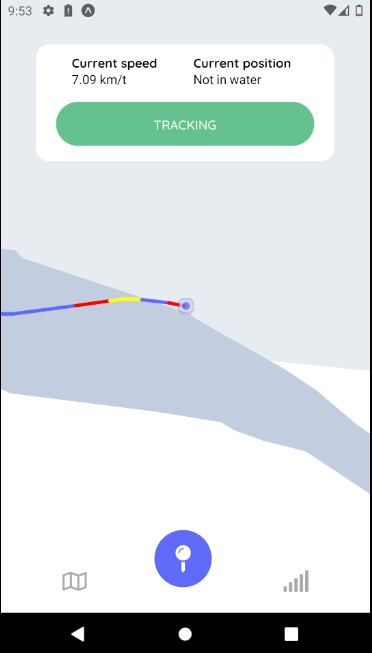

# mobile-systems-kayak

To start the water api using node, in the `/waterCheckAPI` folder use `node index.js` 

To run the app first start a android emulator and then use the following command `expo start` in the `\app` folder.

# Kayaklog

:iphone: React native app that for logging trajectory data in a kayak

 

## Features

* Displays A list with asset name, price, latest 24 hours percent change and asset logo for the top 50 cryptos
* Comes with a content provider so Crypto data can be used in other apps through the provided ContentProvider
* Uses fragments to provide single views for phones and a two pane view for tablets that contains crypto information as name, logo,
  description and price.

## Interesting libraries used

* <a href="https://github.com/react-native-maps/react-native-maps">React Native Maps</a>: Library used for map in application.
* <a href="https://github.com/mroderick/PubSubJS">PubSubJS</a>: Library used to publish and subscribe trajectory data
